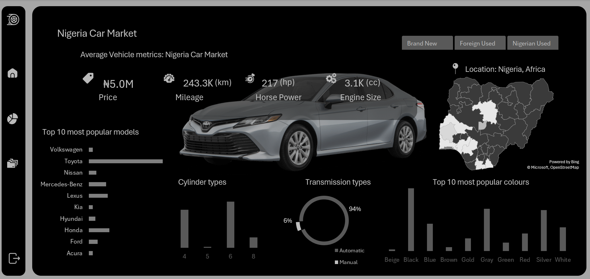

# Cars45 Sales Report

**Goal:** Analyze sales performance, identify top-selling vehicle models, and track monthly revenue trends for Cars45.

**Highlights**
- Built interactive dashboard to monitor and analyze key metrics.
- **Impact:** +20% sales forecasting accuracy and identification of underperforming sales regions.
- Tools: Excel (PivotTables, Power Query, Conditional Formatting)

## Files
- [`car45_data.xlsx`](/Excel/Cars45-Sales-Report/car45_data.xlsx) — Main dashboard file.
- [`dashboard.PNG`](/Excel/Cars45-Sales-Report/dashboard.PNG) [`Table.PNG`](/Excel/Cars45-Sales-Report/Table.PNG)  [`Pivots.PNG`](/Excel/Cars45-Sales-Report/Pivots.PNG) — Screenshots and visuals.

Download file [`car45_data.xlsx`](/Excel/Cars45-Sales-Report/car45_data.xlsx) for an in-depth overview and interactivity of the dashboard.
## Screenshots

---
