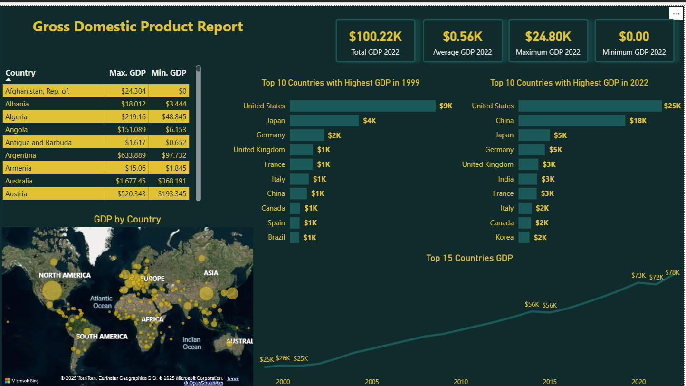

# Global GDP Analysis Dashboard

**Goal:** Track GDP growth trends, compare countries, and identify highest and lowest GDP years.

**Highlights**
- Built interactive dashboard to monitor and analyze key metrics.
- **Impact:** Enabled quick macroeconomic comparisons across countries for policy and research purposes.
- Tools: Power Query, Power BI (DAX Measures, Hierarchies, Filters)

## Files
- `GDP set.pbix` — Main dashboard file.
- `GDP set.pdf(PowerBI/GDP-Dashboard/GDP set.pdf)` — Exported report for offline viewing.
- `Dashboard.PNG  Table.PNG  Model.PNG` — Screenshots and visuals.

Download file `GDP set.pbix` for an in-depth overview and interactivity of the dashboard.
## Screenshots

---
