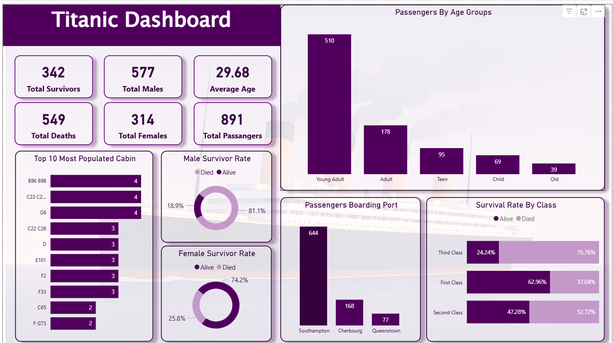

# Titanic Passenger Analysis Dashboard

**Goal:** Visualize survival rates by demographics and travel class for historical insights.

**Highlights**
- Built interactive dashboard to monitor and analyze key metrics.
- **Impact:** Revealed survival patterns across passenger segments, supporting analytical storytelling.
- Tools: Power Query, Power BI (DAX, Slicers, Drill-through, Conditional Formatting)

## Files
- `Titanic set.pbix` — Main dashboard file.
- `Titanic set.pdf` — Exported report for offline viewing.
- `Dashboard.PNG  Table.PNG  Model.PNG` — Screenshots and visuals.

Download file `Titanic set.pbix` for an in-depth overview and interactivity of the dashboard.
## Screenshots

---
